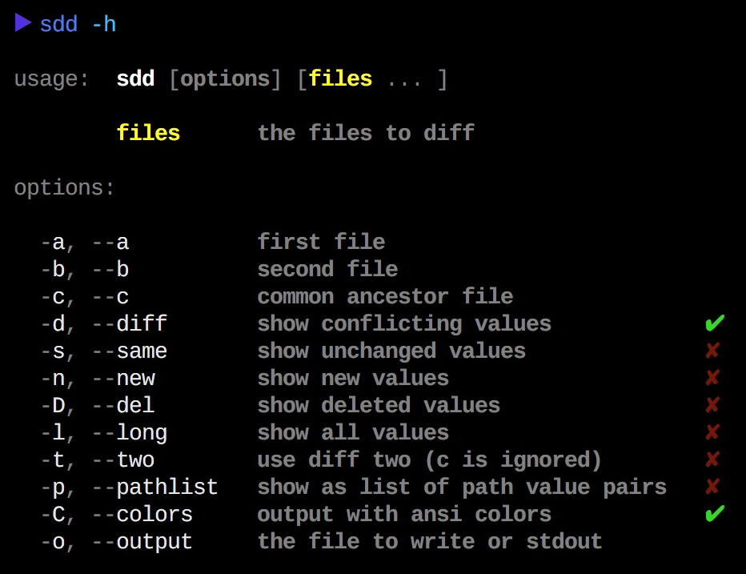

### module

```coffee-script
sdd = require 'sdd'

A = { a: 1, b: 2, c: 3, d: 3,      }
B = { a: 3, b: 2,             z: 4 }

sdd.diff.two A, B

# diff: [[["a"], 1, 3]]  # a changed from 1 to 3
# same: [[["b"], 2   ]]   
# new:  [[["z"], 4   ]]   
# del:  [[["c"], 3   ], [["d"], 3]]   

C = { a: 0, b: 1, c: 3, d: 4 } # the common ancestor of A and B

sdd.diff.three A, B, C
        
# diff: [[["a"], 1 , 3], [["d"], 3, null]] # conflicting changes
# same: [[["b"], 2],     [["z"], 4      ]] # same in A and B or new in A or B
# del:  [[["c"], 3                      ]] # c was removed in A or B only
#
# also included are some intermediary results:
#
# c2a: {"diff":[[["a"],0,1],[["b"],1,2],[["d"],4,3]],"new":[],"same":[[["c"],3]],"del":[]}
# c2b: {"diff":[[["a"],0,3],[["b"],1,2]],"new":[[["z"],4]],"same":[],"del":[[["c"],3],[["d"],4]]}
# a2b: {"diff":[[["a"],1,3]],"new":[[["z"],4]],"same":[[["b"],2]],"del":[[["c"],3],[["d"],3]]}
# b2a: {"diff":[[["a"],3,1]],"new":[[["c"],3],[["d"],3]],"same":[[["b"],2]],"del":[[["z"],4]]}
        
# happy diffing :-)
```
